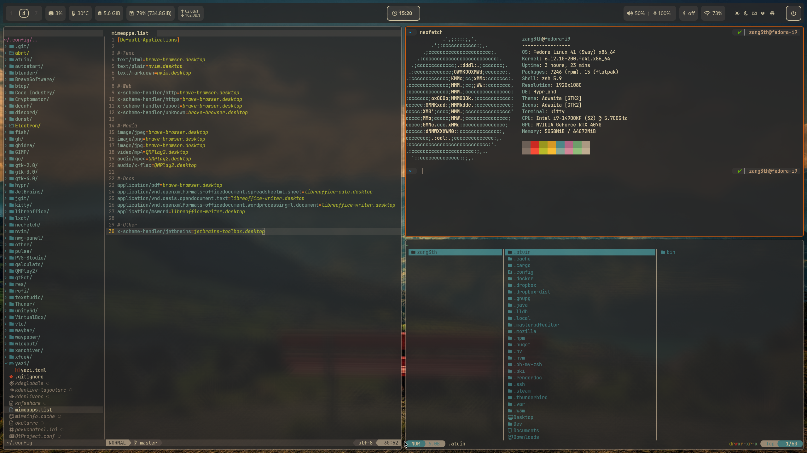

# Linux Config

## General stuff

- Just another dot file repo
- Color scheme is *gruvbox_dark*

## Setup

- **Distribution:** Fedora
- **Compositor:** hyprland
- **Bar:** waybar
- **Lockscreen:** hyprlock
- **Screenshots:** hyprshot
- **Wallpaper:** hyprpaper + waypaper
- **Logout:** wlogout
- **Notifications:** dunst
- **Launcher:** rofi
- **Filemanager:** yazi
- **Greeter:** greetd + ReGreet
- **Terminal:** kitty
- **Shell:** zsh + oh-my-zsh + p10k

## Appearance

